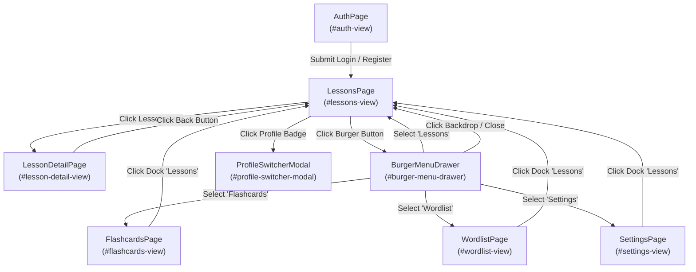

# GRAPH.md Format & Specification

The `GRAPH.md` file must be created and maintained in the root of the page objects folder (e.g. `tests/e2e/pages/GRAPH.md`). It acts as a living map of the application's user interface, state transitions, and interactive capabilities.

---

## Structure of `GRAPH.md`

Every `GRAPH.md` file must contain three main sections:
1. **Visual State Graph (Mermaid)**: A visual state machine representing views, overlays, and transitions.
2. **Pages & Operations Catalog**: A breakdown of each page, its POM class, and all actions/operations supported on that page.
3. **Components & Dialogs Catalog**: Shared components, modals, and drawers with their capabilities.

---

## Example `GRAPH.md` Template

```markdown
# Application Page & Navigation Graph

This document maps the application UI views, modal dialogs, and interactive operations discovered via `playwright-page-objects`.

---

## Visual Navigation Graph



---

## Pages & Operations Catalog

### 1. `AuthPage`
- **Container / Selector**: `#auth-view`
- **File**: [`AuthPage.ts`](./AuthPage.ts)
- **Description**: Authentication gateway supporting username/password login and new user registration with language pair selection.
- **Available Operations**:
  - `switchTab('login' | 'register')`: Toggles between login and registration forms.
  - `login(identifier, password)`: Submits credentials to authenticate.
  - `register(username, password, nativeLang, targetLang)`: Creates an account with language preferences.
  - `expectErrorMessage(text)`: Asserts error alert visibility and message.
- **Outgoing Transitions**:
  - Successful login/register $\rightarrow$ `LessonsPage`.

### 2. `LessonsPage`
- **Container / Selector**: `#lessons-view`
- **File**: [`LessonsPage.ts`](./LessonsPage.ts)
- **Description**: Primary dashboard displaying available language lessons, generator prompt, and progress.
- **Available Operations**:
  - `generateLesson(topicPrompt)`: Enqueues a new lesson generation job.
  - `openLesson(index | title)`: Opens the detailed interactive lesson.
  - `deleteLesson(index)`: Deletes a lesson card from the list.
  - `refreshLessons()`: Reloads latest lessons from the backend.
- **Outgoing Transitions**:
  - Click lesson card $\rightarrow$ `LessonDetailPage`.
  - Header burger button $\rightarrow$ `BurgerMenuDrawer`.
  - Header profile badge $\rightarrow$ `ProfileSwitcherModal`.

### 3. `LessonDetailPage`
- **Container / Selector**: `#lesson-detail-view`
- **File**: [`LessonDetailPage.ts`](./LessonDetailPage.ts)
- **Description**: Full interactive study session containing reading passage, vocabulary breakdown, and comprehension exercises.
- **Available Operations**:
  - `readPassage()`: Reads lesson story and dialogue sections.
  - `selectTextForTranslation(text)`: Highlights vocabulary to view instant translation popup.
  - `answerExercise(questionIndex, choiceIndex)`: Selects multiple-choice answers.
  - `submitExercise()`: Validates answer and checks feedback banner.
  - `goBack()`: Returns to main lessons list.
- **Outgoing Transitions**:
  - Click back button $\rightarrow$ `LessonsPage`.

### 4. `FlashcardsPage`
- **Container / Selector**: `#flashcards-view`
- **File**: [`FlashcardsPage.ts`](./FlashcardsPage.ts)
- **Description**: SRS (Spaced Repetition System) interactive card review player.
- **Available Operations**:
  - `flipCard()`: Flips between front (prompt) and back (answer/translation).
  - `rateCard(score: 1 | 2 | 3 | 4 | 5)`: Submits SM-2 review score and advances deck.
  - `pronounce()`: Triggers text-to-speech audio pronunciation.
- **Outgoing Transitions**:
  - Complete review session $\rightarrow$ Empty deck summary.
  - Navigation controls $\rightarrow$ `LessonsPage`, `WordlistPage`.

### 5. `WordlistPage`
- **Container / Selector**: `#wordlist-view`
- **File**: [`WordlistPage.ts`](./WordlistPage.ts)
- **Description**: Vocabulary repository displaying all learned words, translations, and mastery stats.
- **Available Operations**:
  - `searchWord(query)`: Filters word table by text.
  - `addWord(word, translation)`: Submits new manual word pair.
  - `deleteWord(id)`: Removes word from vocabulary.
- **Outgoing Transitions**:
  - Navigation controls $\rightarrow$ `LessonsPage`, `FlashcardsPage`.

---

## Shared Components & Overlays Catalog

### 1. `HeaderComponent`
- **Container**: `#app-header`
- **File**: [`components/HeaderComponent.ts`](./components/HeaderComponent.ts)
- **Host Pages**: All authenticated pages (`LessonsPage`, `FlashcardsPage`, `WordlistPage`, `SettingsPage`).
- **Operations**:
  - `openBurgerMenu()` $\rightarrow$ Opens `BurgerMenuDrawer`.
  - `openProfileSwitcher()` $\rightarrow$ Opens `ProfileSwitcherModal`.

### 2. `BottomDockComponent`
- **Container**: `#bottom-dock`
- **File**: [`components/BottomDockComponent.ts`](./components/BottomDockComponent.ts)
- **Host Pages**: Mobile viewport for all views.
- **Operations**:
  - `navigateTo(view: 'lessons' | 'flashcards' | 'wordlist' | 'settings')` $\rightarrow$ Transitions view.

### 3. `BurgerMenuDrawer`
- **Container**: `#burger-menu-drawer`
- **File**: [`components/BurgerMenuDrawer.ts`](./components/BurgerMenuDrawer.ts)
- **Operations**:
  - `selectNavLink(link)`: Navigates to selected view and closes drawer.
  - `close()`: Closes drawer via close button or backdrop click.

### 4. `ProfileSwitcherModal`
- **Container**: `#profile-switcher-modal`
- **File**: [`dialogs/ProfileSwitcherModal.ts`](./dialogs/ProfileSwitcherModal.ts)
- **Operations**:
  - `selectProfile(profileName)`: Changes active learning language pair.
  - `addNewProfile(sourceLang, targetLang)`: Creates a new language profile.
  - `close()`: Dismisses modal.
```
