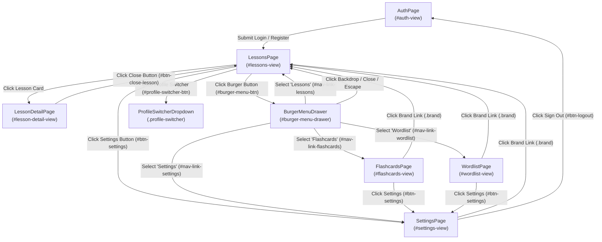

# Application Page & Navigation Graph

This document maps the application UI views, modal dialogs, and interactive operations discovered via `playwright-page-objects`.

---

## Visual Navigation Graph

---

## Pages & Operations Catalog

### 1. `AuthPage`
- **Container / Selector**: `#auth-view`
- **File**: [`AuthPage.ts`](./AuthPage.ts)
- **Description**: Authentication gateway supporting username/password login and new user registration with native and learning language pairs.
- **Available Operations**:
  - `switchTab('login' | 'register')`: Toggles between login (`#login-form`) and registration (`#register-form`) forms.
  - `login(usernameOrEmail, password)`: Fills credentials and clicks `#btn-login-submit`.
  - `register(username, password, nativeLang, targetLang)`: Creates an account with language preferences.
  - `expectErrorMessage(text)`: Asserts error alert visibility (`#auth-alert`) and text content.
- **Outgoing Transitions**:
  - Successful login/register $\rightarrow$ `LessonsPage`.

### 2. `LessonsPage`
- **Container / Selector**: `#lessons-view`
- **File**: [`LessonsPage.ts`](./LessonsPage.ts)
- **Description**: Primary dashboard displaying available language lessons, status badges (Generating, Reading, Quiz, Completed), and word pills.
- **Available Operations**:
  - `expectEmpty()`: Asserts empty state (`#lessons-empty`) is visible when no lessons exist.
  - `getLessonCount()`: Returns number of lesson cards rendered.
  - `openLesson(indexOrNumber)`: Clicks a lesson card to enter the study session.
  - `openLessonMenu(indexOrNumber)`: Opens the three-dot action dropdown (`.lesson-dropdown-menu`).
  - `deleteLesson(indexOrNumber)`: Clicks the delete option (`.dropdown-item-delete`) inside the lesson menu.
  - `header.openBurgerMenu()`: Opens navigation drawer.
  - `dock.addWordOrText(text)`: Submits word or sentence from the bottom dock.
- **Outgoing Transitions**:
  - Click lesson card $\rightarrow$ `LessonDetailPage`.
  - Header burger button $\rightarrow$ `BurgerMenuDrawer`.
  - Header profile button $\rightarrow$ `ProfileSwitcherDropdown`.
  - Header settings button $\rightarrow$ `SettingsPage`.

### 3. `LessonDetailPage`
- **Container / Selector**: `#lesson-detail-view`
- **File**: [`LessonDetailPage.ts`](./LessonDetailPage.ts)
- **Description**: Interactive multi-modal study session containing reading chunk selection, multiple-choice quiz, flashcard drill, and vocabulary list.
- **Available Operations**:
  - `close()`: Clicks `#btn-close-lesson` to return to Lessons.
  - `switchMode('reading' | 'quiz' | 'cards' | 'list')`: Switches study modes via header mode toggles.
  - **Reading Mode**:
    - `selectChunk(index)`: Toggles selection on clickable word/phrase chips (`.reading-chunk-chip`).
    - `prepareLesson()`: Submits selected words via `#btn-prepare-lesson` to generate quizzes.
  - **Quiz Mode**:
    - `selectQuizOption(index)`: Selects multiple-choice option (`#quiz-option-${n}`).
    - `nextQuizQuestion()`: Advances to the next question or finishes quiz (`#btn-next-quiz-question`).
    - `restartQuiz()`: Retakes the quiz from the completed screen (`#btn-restart-quiz`).
  - **Flashcards Mode**:
    - `flipCard()`: Flips the 3D flashcard (`#lesson-flashcard`, waits for flip transition).
    - `nextCard()` / `prevCard()`: Navigates through cards in the lesson.
    - `restartFlashcards()`: Restarts flashcard drill from the completed state.
- **Outgoing Transitions**:
  - Click close button $\rightarrow$ `LessonsPage`.

### 4. `FlashcardsPage`
- **Container / Selector**: `#flashcards-view`
- **File**: [`FlashcardsPage.ts`](./FlashcardsPage.ts)
- **Description**: SRS (Spaced Repetition System) interactive card review player.
- **Available Operations**:
  - `flipCard()`: Flips between front (prompt) and back (translation/context, waits for flip transition).
  - `rateAgain()`: Submits rating "again" (forgot / red ✕, `#btn-srs-wrong`).
  - `rateGood()`: Submits rating "good" (remembered / green ✓, `#btn-srs-correct`).
  - `pronounce()`: Plays audio pronunciation (`#btn-audio`).
  - `restartDeck()`: Restarts reviewing cards when session is complete (`#btn-restart-deck`).
  - `expectSessionCompleted()`: Asserts deck complete summary (`#empty-state`).
- **Outgoing Transitions**:
  - Complete review session $\rightarrow$ Empty deck summary.
  - Drawer / Header navigation $\rightarrow$ `LessonsPage`, `WordlistPage`, `SettingsPage`.

### 5. `WordlistPage`
- **Container / Selector**: `#wordlist-view`
- **File**: [`WordlistPage.ts`](./WordlistPage.ts)
- **Description**: Vocabulary repository displaying learned words, translations, color-coded recall rate badges, and pagination.
- **Available Operations**:
  - `expectEmpty()`: Asserts empty state (`#wordlist-empty`).
  - `getWordCount()`: Returns count of word cards on the current page.
  - `openWordMenu(textOrIndex)`: Opens word action menu (`.btn-word-dots-menu`).
  - `deleteWord(textOrIndex)`: Removes word via dropdown delete option.
  - `getRecallRate(textOrIndex)`: Retrieves recall rate percentage text from badge.
  - `nextPage()` / `prevPage()`: Navigates through paginated pages (`#btn-next-page`, `#btn-prev-page`).
- **Outgoing Transitions**:
  - Drawer / Header navigation $\rightarrow$ `LessonsPage`, `FlashcardsPage`, `SettingsPage`.

### 6. `SettingsPage`
- **Container / Selector**: `#settings-view`
- **File**: [`SettingsPage.ts`](./SettingsPage.ts)
- **Description**: User profile and account management view. Bottom dock is intentionally hidden on this view.
- **Available Operations**:
  - `expectUsername(name)`: Verifies displayed account username (`.settings-user-name`).
  - `logout()`: Clicks `#btn-logout` to end user session and return to authentication view.
- **Outgoing Transitions**:
  - Click logout $\rightarrow$ `AuthPage`.
  - Drawer / Header navigation $\rightarrow$ `LessonsPage`, `FlashcardsPage`, `WordlistPage`.

---

## Shared Components & Overlays Catalog

### 1. `HeaderComponent`
- **Container**: `.app-header`
- **File**: [`components/HeaderComponent.ts`](./components/HeaderComponent.ts)
- **Host Pages**: All authenticated pages (`LessonsPage`, `FlashcardsPage`, `WordlistPage`, `SettingsPage`).
- **Operations**:
  - `openBurgerMenu()` $\rightarrow$ Opens `BurgerMenuDrawer`.
  - `clickBrand()` $\rightarrow$ Navigates back to `LessonsPage`.
  - `openSettings()` $\rightarrow$ Navigates to `SettingsPage`.
  - `openProfileSwitcher()` $\rightarrow$ Opens `ProfileSwitcherDropdown`.

### 2. `BurgerMenuDrawer`
- **Container**: `#burger-menu-drawer`
- **File**: [`components/BurgerMenuDrawer.ts`](./components/BurgerMenuDrawer.ts)
- **Operations**:
  - `expectOpen()` / `expectClosed()`: Asserts drawer visibility state.
  - `close()`: Dismisses drawer via `#drawer-close-btn`.
  - `closeViaBackdrop()`: Dismisses drawer by clicking `#menu-backdrop`.
  - `closeViaEscape()`: Dismisses drawer using the Escape keyboard shortcut.
  - `navigateTo(target)`: Navigates to 'lessons', 'flashcards', 'wordlist', or 'settings'.

### 3. `ProfileSwitcherDropdown`
- **Container**: `.profile-switcher`
- **File**: [`dialogs/ProfileSwitcherDropdown.ts`](./dialogs/ProfileSwitcherDropdown.ts)
- **Operations**:
  - `toggle()`: Opens or closes the dropdown menu (`.profile-dropdown`).
  - `selectProfile(languagePair)`: Switches active learning language pair.
  - `addProfile(sourceLang, targetLang)`: Opens form and adds a new learning profile.
  - `cancelAddProfile()`: Cancels profile creation form.

### 4. `BottomDockComponent`
- **Container**: `.bottom-dock`
- **File**: [`components/BottomDockComponent.ts`](./components/BottomDockComponent.ts)
- **Host Pages**: Visible on `LessonsPage`, `FlashcardsPage`, and `WordlistPage` (hidden on `LessonDetailPage` and `SettingsPage`).
- **Operations**:
  - `addWordOrText(text, submitVia)`: Inputs text and submits via send button or Enter key.
  - `expectVisible()` / `expectHidden()`: Asserts dock visibility.

---

## E2E Test Suite Specifications

The Playwright test suite is partitioned into dedicated page tests and cross-cutting functional tests:

### Page-Specific Specifications
| Test Spec | Target Page Object / Component | Test Count | Visual Snapshots (`toHaveScreenshot`) | Description |
|---|---|---|---|---|
| [`tests/e2e/auth.spec.ts`](../auth.spec.ts) | `AuthPage` | 4 | Login layout, Register layout | Auth gateway & tab switching workflows |
| [`tests/e2e/lessons.spec.ts`](../lessons.spec.ts) | `LessonsPage` | 6 | Empty dashboard, Populated cards grid | Lesson cards, contextual menu, deletion |
| [`tests/e2e/lesson-detail.spec.ts`](../lesson-detail.spec.ts) | `LessonDetailPage` | 4 | Reading mode, Quiz mode, Cards mode | Reading chunks, quiz questions, flashcards drill |
| [`tests/e2e/flashcards.spec.ts`](../flashcards.spec.ts) | `FlashcardsPage` | 7 | Empty queue, Card front, Card back | SRS sessions, flips, ease ratings, audio, restart |
| [`tests/e2e/wordlist.spec.ts`](../wordlist.spec.ts) | `WordlistPage` | 5 | Empty wordlist, Populated cards list | Word cards, recall badges, pagination, deletion |
| [`tests/e2e/settings.spec.ts`](../settings.spec.ts) | `SettingsPage` | 2 | Settings view layout (masked username) | Profile info verification and sign out flow |

### Cross-Cutting & Functional Specifications
| Test Spec | Components Involved | Test Count | Visual Snapshots (`toHaveScreenshot`) | Description |
|---|---|---|---|---|
| [`tests/e2e/navigation.spec.ts`](../navigation.spec.ts) | `HeaderComponent`, `BurgerMenuDrawer` | 3 | — | Drawer open/close, backdrop dismiss, page switching |
| [`tests/e2e/quick-input.spec.ts`](../quick-input.spec.ts) | `BottomDockComponent`, `LessonsPage` | 3 | — | Single-word translation vs auto lesson generation (>4 words) |
| [`tests/e2e/mobile-layout.spec.ts`](../mobile-layout.spec.ts) | All Views & Components | 3 | Viewport layout, Scrolled dock clearance | Mobile viewport (no overflow), dock clearance, fixed elements |
